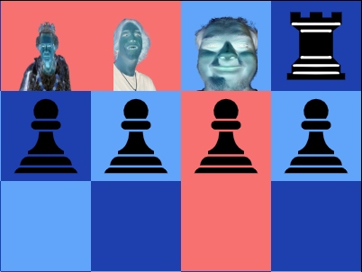
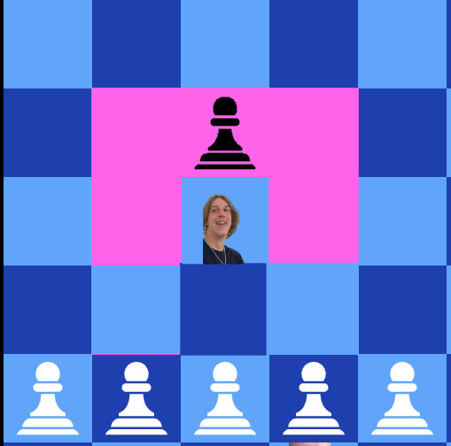

# BkChess: It's like chess but worse

In this project I want to attemt to make Chess easier to learn and also less boring by upping the pace
white making it more "realistic" by applying logic

The differences between this and normal chess are:
- King and queen need to be captured to win (a country can still function with only one monarch and gender equality)
- Castling is not allowed (it's dumb, I don't understand it so it's clearly not easy /s)
- Knights are brutes
- Brutes only move 2 steps in a cross and kill everything in their path including thier own team



- Enpessant is not allowed


- Promotion is not allowed this leaves pawn stranded and unable to move as a kind of meat shield, brutes would be best to clear the way if you want them gone


- The bichop aka clown has an AOE distraction effect, the blocks in front of it is are confused and won't be able to move except for the king because he's based. 
Can walk 1 step each direction
  
- If movement fields of clowns overlaps and the other clown moves the clown will need to move to reset it because attention has been stolen
- Clowns can't distract other clowns

- Queen only moves 1 step in any direction and can't kill anything because she's old and decrepit, when she dies skip 2 turns

The code is a mess right now and I should maybe fix it sometime...

Progress so far:
- [x] Turns
- [x] Board made
- [ ] Victory condition

- Pawns
- [x] Pawns move
- [x] Pawns stop when they should
- [x] Pawns attack

- Brutes
- [x] Brute move
- [x] Brute attack
- [x] Brute can friendly fire

- Clowns
- [X] Clowns move
- [X] Clowns stop moving when they should
- [X] Clowns distract the right troops
- [X] Clowns can't distract themselves
- [X] Can remove each other's distraction

- Rooks
- [X] Rooks move
- [X] Rooks attack

- Queens
- [ ] Queens move
- [ ] Queens attack
- [ ] Turns skip at death

- Kings
- [X] Kings move
- [X] Kings attack

- Advanced stuff/rules (might make, might not):
- [ ] Check prevent walking into check https://www.chess.com/terms/check-chess  
- [ ] Stalemate  https://www.chess.com/terms/stalemate-chess

## How to start programming

Project was made in [nuxt 3](https://v3.nuxtjs.org)

### Setup

Make sure to install the dependencies:

```bash
# npm
npm install
```

### Development Server

Start the development server on http://localhost:3000

```bash
npm run dev
```

### Production

Build the application for production:

```bash
npm run build
```

Locally preview production build:

```bash
npm run preview
```

Checkout the [deployment documentation](https://v3.nuxtjs.org/guide/deploy/presets) for more information.
